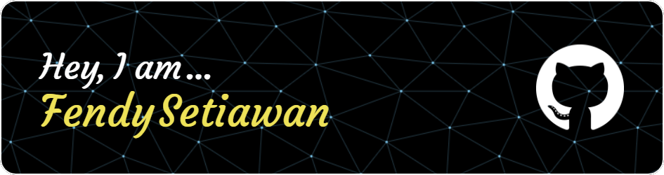

# 💫 About Me:
Passionate in workflow automation :computer: and the application of large language models :loudspeaker: in structural engineering. 
Currently expanding my knowledge and skills in big data and machine learning. 
My goal is to harness the power of these emerging technologies to drive innovation and efficiency.

# 💻 Tech Stack:
      

# 📊 GitHub Stats:
 
 
<!--  -->

## 🏆 GitHub Trophies

